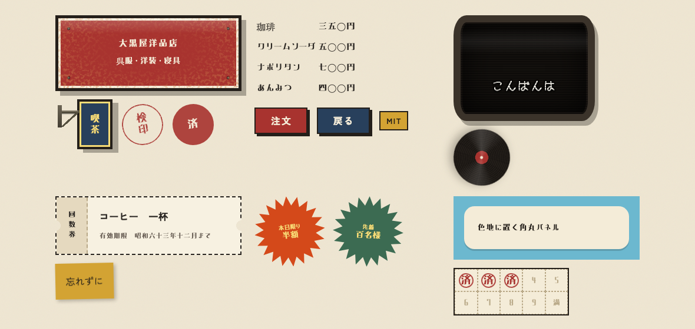
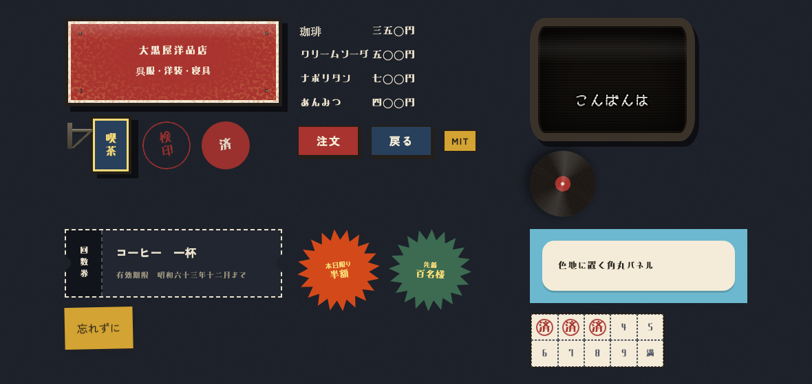

# 昭和レトロ.css

**見本帳 → https://kanade0525.github.io/showa-retro-css/**

*[English](./README.en.md)*



昭和レトロ CSS フレームワーク。ホーロー看板・純喫茶のお品書き・回数券・ブラウン管・刷りのかすれを、クラス一つで再現します。

**JavaScript も画像も使いません。** 読みに行くのは CSS だけです。全部入りで 67.0KB（**gzip 後 13.9KB**）。必要なところだけ読めば 8KB まで落ちます。

## 導入

```html
<link rel="stylesheet" href="showa-retro.css">

<body class="sw">
  <button class="sw-btn is-enji">押す</button>
</body>
```

これだけで動きます。書体はOS標準の和文に落ちます。

```sh
npm i showa-retro.css
```

```js
import 'showa-retro.css';        // 全部入り
import 'showa-retro.css/min';    // 圧縮版 67.0KB / gzip 13.9KB
```

### 必要なところだけ読む

`src/` に分かれています。**`01-base.css` だけ必須**で、あとは使うものを足してください。

| 読むもの | 最小化後 | gzip後 |
| --- | --- | --- |
| 全部入り | 67.0KB | 13.9KB |
| よく使う一式（base・文字組・看板・ボタン・表・割付・強制配色） | 28.6KB | 6.9KB |
| base と文字組だけ | 9.2KB | 3.0KB |

大きいのは紙もの・看板・地紋・家電です（最小化後でそれぞれ 10KB 前後）。

```css
@import "showa-retro.css/src/01-base.css";      /* 必須。色・書体・夜間モード */
@import "showa-retro.css/src/02-moji.css";      /* 文字組 */
@import "showa-retro.css/src/04-kanban.css";    /* 看板 */
@import "showa-retro.css/src/08-kami.css";      /* 紙もの */
```

| ファイル | 中身 |
| --- | --- |
| `01-base.css` | **必須。** 書体・色・夜間モード・下地 |
| `02-moji.css` | 見出しと文字組 |
| `03-suri.css` | かすれ・版ズレ・退色 |
| `04-kanban.css` | 枠と看板 |
| `05-sousa.css` | ボタン・券売機・つまみ |
| `06-kinyu.css` | 記入欄 |
| `07-hyo.css` | 表・お品書き・伝票 |
| `08-kami.css` | 紙もの |
| `09-misesaki.css` | 店先 |
| `10-kaden.css` | 家電 |
| `11-jimon.css` | 地紋 |
| `12-ugoki.css` | 動き |
| `13-warituke.css` | 割付とユーティリティ |
| `14-forced-colors.css` | 強制配色対応 |

PostCSS や PurgeCSS を通すなら、全部入りを食わせて未使用クラスを落とすほうが確実です。

### 書体（任意）

三通りあります。**どれも入れなければ、OS標準の和文書体に落ちてそのまま動きます。**

```html
<!-- ① 速い。代用書体を Google Fonts から並列に取る -->
<link rel="preconnect" href="https://fonts.googleapis.com">
<link rel="preconnect" href="https://fonts.gstatic.com" crossorigin>
<link rel="stylesheet" href="https://fonts.googleapis.com/css2?family=M+PLUS+1+Code&family=DotGothic16&family=Shippori+Antique&family=Yusei+Magic&family=Zen+Kaku+Gothic+New:wght@400;700&family=Zen+Maru+Gothic:wght@400;700&family=Zen+Old+Mincho:wght@400;700&display=swap">

<!-- ② 付属の晩秋レトロミン（見出し用）。外部に通信しない -->
<link rel="stylesheet" href="showa-retro-fonts.css">
```

```css
/* ③ お手軽。ただし @import は直列2ホップになるので遅い */
@import "showa-retro.css/webfonts";
```

v1 では ② のファイルが Google Fonts を `@import` していました。既定を遅い側に倒していたので分けています。

### 書体を自前で持つ

Google Fonts への直参照では、閲覧者のIPアドレスが Google に渡ります。ドイツの地裁でこれが問題とされた事例があるので、EU向けなら自前ホスティングが無難です。7書体とも SIL Open Font License なので、ダウンロードして自分のサーバに置けます。

1. [Google Fonts](https://fonts.google.com/) から Zen Old Mincho / Zen Kaku Gothic New / Zen Maru Gothic / Shippori Antique / Yusei Magic / DotGothic16 / M PLUS 1 Code を取得
2. woff2 に変換して自分のサーバに置く
3. `@font-face` を自分で書く（`showa-retro-webfonts.css` の末尾に雛形があります）

## 色の三層

色は三つの層に分かれています。**ここを混ぜると夜間モードで壊れます。**

| 層 | トークン | 昼夜 | 用途 |
| --- | --- | --- | --- |
| ① 紙と墨 | `--sw-paper` `--sw-sumi` ほか | 入れ替わる | ページの地と文字 |
| ② 刷り色 | `--sw-enji` `--sw-karashi` `--sw-tokiwa` `--sw-kon` `--sw-asagi` `--sw-momo` `--sw-daidai` `--sw-mizu` | 明度を調整 | 紙に刷る八色 |
| ③ 物体色 | `--sw-o-*` | **変えない** | ホーロー看板・袖看板・レコード盤など実物の塗り |



上の二枚は同じ HTML です。紙と文字は入れ替わっているのに、看板・袖看板・POPの色だけが変わっていないことに注目してください。

ホーロー看板は夜になっても色が変わりません。だから物体色は昼夜で固定しています。逆に、地色をテーマ変数から取りながら文字色を直書きすると、夜に地色だけが反転して文字が読めなくなります。地色を持つ部品は文字色も対で持たせてください。

刷り色は一枚で多くて三色までを目安に。昭和の印刷は版が少ないので、色数を絞るほど"らしく"なります。

### コントラスト比（実測）

色が主役のフレームワークなので、全色を測って載せます。`npm run contrast` で再計算されます。**AA は本文に使える下限（4.5）**、AA大は18.66px以上か24px相当の太字にのみ使える下限（3.0）です。

<!-- contrast:start 自動生成。npm run contrast で更新します -->
**刷り色を紙に載せたとき**

| 刷り色 | 変数 | 昼（紙の上） | 夜（宵闇の上） |
| --- | --- | --- | --- |
| 墨 | `--sw-sumi` | 12.10　AAA | 13.11　AAA |
| 臙脂 | `--sw-enji` | 5.32　AA | 5.03　AA |
| 芥子 | `--sw-karashi` | 2.08　不足 | 8.82　AAA |
| 常磐 | `--sw-tokiwa` | 4.95　AA | 6.77　AA |
| 紺 | `--sw-kon` | 8.55　AAA | 6.39　AA |
| 浅葱 | `--sw-asagi` | 2.61　不足 | 9.24　AAA |
| 退紅 | `--sw-momo` | 2.64　不足 | 7.98　AAA |
| 橙 | `--sw-daidai` | 2.97　不足 | 6.77　AA |
| 水 | `--sw-mizu` | 2.38　不足 | 8.33　AAA |

**物体色の地と字**（昼夜で変わらないので一度きり）

| 地 | 字 | 比 | 判定 | 使っている所 |
| --- | --- | --- | --- | --- |
| `--sw-o-karashi` | `--sw-o-enji` | 2.85 | 不足 | `.sw-pop.is-karashi` |
| `--sw-o-shu` | `--sw-o-usuki` | 3.22 | AA大のみ | `.sw-pop` |
| `--sw-o-tokiwa` | `--sw-o-usuki` | 4.49 | AA大のみ | `.sw-pop.is-tokiwa` |
| `--sw-o-daidai` | `--sw-o-sumi` | 4.80 | AA | `.sw-obi.is-daidai` |
| `--sw-o-enji` | `--sw-o-usuki` | 4.83 | AA | `.sw-sodekanban.is-enji` |
| `--sw-o-jushi-iri` | `#5f584a` | 4.87 | AA | `.sw-kenbai.is-urikire` |
| `--sw-o-aka` | `--sw-o-kinari` | 4.88 | AA | `.sw-kanban.is-aka` |
| `#f7f2e0` | `--sw-o-aka` | 5.12 | AA | `.sw-denshou` |
| `--sw-o-tokiwa` | `--sw-o-kinari` | 5.22 | AA | `.sw-kanban.is-tokiwa` |
| `#7a5a42` | `--sw-o-kinari` | 5.29 | AA | `.sw-shashin > :where(.ban)` |
| `--sw-o-enji` | `--sw-o-kinari` | 5.61 | AA | `.sw-kanban` |
| `--sw-o-momo` | `--sw-o-sumi` | 6.15 | AA | `.sw-obi.is-momo` |
| `#cf8e8e` | `--sw-o-sumi` | 6.15 | AA | `.sw-ji-tile.is-momo` |
| `--sw-o-daidai-oshi` | `--sw-o-sumi` | 6.16 | AA | `.sw-btn.is-daidai:hover` |
| `--sw-o-asagi` | `--sw-o-sumi` | 6.66 | AA | `.sw-obi.is-asagi` |
| `#79b0a5` | `--sw-o-sumi` | 6.66 | AA | `.sw-ji-tile` |
| `--sw-o-tokiwa-oshi` | `--sw-o-kinari` | 7.03 | AAA | `.sw-btn.is-tokiwa:hover` |
| `--sw-o-karashi` | `--sw-o-sumi` | 7.04 | AAA | `.sw ::selection` |
| `--sw-o-sumi` | `--sw-o-karashi` | 7.04 | AAA | `.sw-match.is-sumi` |
| `--sw-o-mizu` | `--sw-o-sumi` | 7.31 | AAA | `.sw-obi.is-mizu` |
| `--sw-o-enji-oshi` | `--sw-o-kinari` | 7.56 | AAA | `.sw-btn.is-enji:hover` |
| `#14110e` | `--sw-o-asagi` | 7.67 | AAA | `.sw-tv` |
| `--sw-o-momo-oshi` | `--sw-o-sumi` | 7.68 | AAA | `.sw-btn.is-momo:hover` |
| `--sw-o-kon` | `--sw-o-usuki` | 7.76 | AAA | `.sw-sodekanban` |
| `#f2ecdc` | `#2c3f8c` | 8.11 | AAA | `.sw-aozake` |
| `--sw-o-asagi-oshi` | `--sw-o-sumi` | 8.15 | AAA | `.sw-btn.is-asagi:hover` |
| `--sw-o-karashi-oshi` | `--sw-o-sumi` | 8.40 | AAA | `.sw-btn.is-karashi:hover` |
| `#7d211e` | `--sw-o-kinari` | 8.46 | AAA | `.sw-ji-sofa` |
| `--sw-o-mizu-oshi` | `--sw-o-sumi` | 8.67 | AAA | `.sw-btn.is-mizu:hover` |
| `#2b2b2b` | `#cfcac0` | 8.67 | AAA | `.sw-tv.is-sunaarashi` |
| `--sw-o-kon` | `--sw-o-kinari` | 9.02 | AAA | `.sw-kanban.is-kon` |
| `--sw-o-kon-oshi` | `--sw-o-kinari` | 10.92 | AAA | `.sw-btn.is-kon:hover` |
| `#0d2b4d` | `#d5e6f5` | 11.20 | AAA | `.sw-aozake.is-shashin` |
| `#e5d9bf` | `--sw-o-sumi` | 11.67 | AAA | `.sw-ji-garasu` |
| `#f7db76` | `--sw-o-sumi` | 11.94 | AAA | `.sw-ji-tile.is-usuki` |
| `#f0e6cd` | `--sw-o-sumi` | 13.15 | AAA | `.sw-ji-dosen` |
| `--sw-o-jushi` | `--sw-o-sumi` | 13.50 | AAA | `.sw-kenbai` |
| `#f0ead2` | `--sw-o-sumi` | 13.53 | AAA | `.sw-ji-hanagara.is-tokiwa` |
| `--sw-o-sumi` | `--sw-o-kinari` | 13.87 | AAA | `.sw-obi` |
| `--sw-o-kinari` | `--sw-o-sumi` | 13.87 | AAA | `.sw-shusen` |
| `#120f0c` | `--sw-o-usuki` | 13.96 | AAA | `.sw-denkou` |
| `#f6efe4` | `--sw-o-sumi` | 14.30 | AAA | `.sw-ji-dosen.is-momo` |
| `#f7f1e1` | `--sw-o-sumi` | 14.48 | AAA | `.sw-cassette > .label` |
| `#fbf8f0` | `--sw-o-sumi` | 15.39 | AAA | `.sw-shashin` |
<!-- contrast:end -->

測って分かったことを、そのまま書きます。

- **昼の芥子・浅葱・退紅・橙・水は本文に使えません**（2.08〜2.97）。見出しか、地色として使ってください。夜側はいずれも 6.7 以上あります。刷り色で本文が組めるのは **墨・臙脂・常磐・紺** の四色だけです。
- **`.sw-pop.is-karashi` は 2.85 で、大きい文字でも足りません。** 芥子地に臙脂は実物の特売POPで頻出の配色で、実物が読みにくいのですが、Webで踏襲すると読めません。読ませる必要があるなら `color: var(--sw-o-sumi)` で上書きしてください（7.04 になります）。
- `.sw-pop`（3.22）と `.sw-pop.is-tokiwa`（4.49）は、大きい文字にのみ使える範囲です。POPの値段書きは元々大きいので既定のままにしていますが、小さい注記を載せる場合は色を変えてください。

**かすれ・退色・白黒は、定義上コントラストを落とす装飾です。** `sw-kasure` `sw-taishoku` `sw-monokuro` を本文に当てないでください。刷りの表情を出すための飾りで、読ませる文字に使うものではありません。

## アクセシビリティ

意匠を優先した結果どこが犠牲になっているかを、隠さず書いておきます。

| | 状態 |
| --- | --- |
| キーボード焦点 | `:focus-visible` に 3px の輪郭。強制配色では `Highlight` に切り替え |
| 動き | `sw-anim-*` と走査線・電光掲示板は `prefers-reduced-motion: reduce` で全停止 |
| 夜間モード | OS設定と `data-theme` の両対応。色は反転ではなく置換 |
| 強制配色 | 対応済み（後述）。ただし実物の意匠は作者の色を残しています |
| コントラスト | 全色を実測して上に掲載。**足りない組み合わせがあります** |
| スクリーンリーダー | **何もしていません。** 意味付けは利用者側の HTML の責任です |

**強制配色（Windows ハイコントラスト）の方針。** 意匠の大半をグラデーションと埋め込みSVGと `box-shadow` で描いているため、何もしないとホーロー看板がただの白い箱になります。そこで二つに分けました。

- **実物の意匠**（看板・レコード・ブラウン管・判子など）は `forced-color-adjust: none` で作者の色を残します。写真や図版と同じ扱いです。看板の赤は「装飾」ではなく「その物の色」なので。
- **UI部品**（ボタン・記入欄・表）はシステム配色に委ね、`box-shadow` だけで描いていた境界に `border` を補います。

前者の判断に不服がある場合は `.sw { forced-color-adjust: auto; }` で上書きしてください。

**スクリーンリーダーについて。** このフレームワークは見た目だけを扱います。`sw-kippu` を使っても券として読み上げられませんし、`sw-inkan` は「承認」という字が読まれるだけです。意味が要る所には自分で `aria-*` と適切な要素を当ててください。


## 収録しているもの

| 分類 | 主なクラス |
| --- | --- |
| 書体 | `sw-f-mincho` `sw-f-gothic` `sw-f-jimaku` `sw-f-tegaki` `sw-f-anchikku` `sw-f-maru` `sw-f-dot` |
| 文字組 | `sw-midashi`（`is-kage` 影文字／`is-fukuro` 袋文字／`is-fuchi` 二重縁取り／`is-rittai` 押し出し）`sw-eyebrow` 肩見出し　`sw-lead` リード　`sw-honbun` 本文　`sw-tate` `sw-tcy` `sw-choutai` `sw-heitai` `sw-marker` `sw-boten` `sw-teisei` `sw-shikiri` 区切り |
| 印刷技法 | `sw-hanzure` 版ズレ　`sw-kasure` かすれ　`sw-taishoku` 退色　`sw-monokuro` 白黒 |
| 枠と看板 | `sw-waku`（`is-nijuu` `is-kage` `with-title`）`sw-kanban`（`is-sabi` さび）`sw-sodekanban` `sw-obi` |
| ボタン | `sw-btn` ＋ 6色　`sw-kenbai` 券売機　`sw-tsumami` つまみ　`sw-progress` 目盛り |
| 記入欄 | `sw-field` `sw-label` `sw-input`（`is-genkou` 升目）`sw-select` `sw-textarea` `sw-check` `sw-radio` |
| 表 | `sw-table` `sw-shinagaki` 品書き　`sw-denpyo` 伝票　`sw-list is-maru` 丸数字 |
| 紙もの | `sw-inkan`（`is-mincho` 明朝／`is-kaku` 角印／`is-beta` べた）`sw-fusen` `sw-fukidashi` `sw-kippu` `sw-nifuda` `sw-senjafuda` `sw-noshi` `sw-badge` 徽章　`sw-aozake` 青焼き　`sw-pop` 特売　`sw-shojo` 賞状　`sw-genkou` 原稿用紙　`sw-stampcard` `sw-shashin` |
| 店先 | `sw-noren` `sw-match` マッチラベル　`sw-garasu` 型板ガラス　`sw-denshou` 電照看板 |
| 家電 | `sw-tv`（`is-sunaarashi` 砂嵐／`is-nagare` 走査線）`sw-jimaku` `sw-neon` `sw-denkou` 電光掲示板　`sw-patapata` `sw-keikoutou` `sw-record` `sw-cassette` `sw-dial` 黒電話 |
| 地紋 | `sw-ji-hanagara` 花柄　`sw-ji-dosen` 同心円　`sw-ji-tile` `sw-ji-garasu` `sw-ji-sofa` `sw-ji-ichimatsu` `sw-ji-yagasuri` `sw-ji-koushi` `sw-ji-mizutama` `sw-ji-shima` `sw-ji-ten` `sw-ji-hougan` |
| 飾り | `sw-shusen` 集中線　`sw-hana` 花　`sw-kirakira` キラキラ　`sw-arch` アーチ枠　`sw-panel` 角丸パネル（`is-maru` 丸型）（ 丸型）　`sw-tanzaku` 短冊 |
| 割付 | `sw-wrap` 中央寄せ　`sw-stack` 縦並び　`sw-row` 横並び　`sw-cols` 段組　`sw-c-*` 文字色　`sw-bg-*` 地色　`sw-katamuki-l` `sw-katamuki-r` 傾き |
| 動き | `sw-anim-chirachira` ネオン　`sw-anim-tenmetsu` 蛍光灯　`sw-anim-kaiten` レコード |

動きはすべて `prefers-reduced-motion: reduce` で停止します。

## 昼と夜

夜間モードは色を反転させません。紙を宵闇に、刷り色をネオン管の発色に置き換えます。ネオンの発光は夜だけ点きます。

OS の設定に従うほか、`<html data-theme="dark">` で明示的に指定できます。

## 書体

**下表は代用です。** 本物の昭和の見出し書体（ゴナU 1975・ナール 1973・石井明朝）は写研の所有で、モリサワの復刻も商用書体のため、OFL で一緒に配れません。

| 役割 | 書体（入手先） | 昭和の何か |
| --- | --- | --- |
| `.sw-f-mincho` 明朝 | **同梱**：晩秋レトロミン →（欠けた字は Zen Old Mincho） | 石井明朝・本蘭明朝の方向（代用）**地の文はこれ** |
| `.sw-f-maru` 丸ゴ | Google Fonts：Zen Maru Gothic | ナール（1973・写研）の代用 |
| `.sw-f-anchikku` アンチック | Google Fonts：Shippori Antique | 漫画のセリフ書体（**昭和から続く様式**） |
| `.sw-f-dot` ドット | Google Fonts：DotGothic16 | 16ドットの表示装置（**昭和末期を参照**） |
| `.sw-f-tegaki` 手書POP | Google Fonts：Yusei Magic | 油性マジックの手書き（年代は特定しない） |
| `.sw-f-gothic` 角ゴ | Google Fonts：Zen Kaku Gothic New | 現代の書体。ラベルとボタンに限る |
| `.sw-f-jimaku` 字幕 | 付属なし | しねきゃぷしょん等。手元にあれば使う |

昭和の本文組は明朝です。角ゴを地の文に敷くと現代の顔になるため、`.sw` の既定を明朝にしています。


### 晩秋レトロミン（付属）

すずみばと書林の[晩秋レトロミン ver.3.2](https://suzumi-bato.booth.pm/items/4674383) を付属しています。利用条件でWebサイトへの埋め込みが許諾されているためです（二次配布にあたるので `fonts/bansyu-retoromin/readme.txt` を添付したまま扱ってください）。

**これを地の文にも使っています。** このフレームワークの顔なので、見出しだけに閉じ込めていません。

**ただし収録は教育漢字＋αの1732字です。** 見本帳の本文に出る632字種のうち95字種（15%）が収録外で、次の書体（Zen Old Mincho）に落ちて混植になります。作者も readme で「本文組というよりも、見出し向けのフォント」と書いています。**混植を承知のうえでの既定です。**

避けたい場合は `--sw-mincho` から晩秋レトロミンを外してください。字が揃った明朝に落ちて、そのまま動きます。

変数は二つありますが、中身は同じです。

| 変数 | 中身 | 使う場所 |
| --- | --- | --- |
| `--sw-mincho` | 晩秋レトロミン → Zen Old Mincho ほか | 地の文。`.sw` の既定 |
| `--sw-retromin` | `--sw-mincho` と同じ | 見出し・看板・POP など「ここはレトロミンで組みたい」と部品が表明する所 |

分けてあるのは、**地の文だけ別の明朝にしたくなったとき**のためです。その場合は `--sw-mincho` を差し替えれば、見出しと看板はレトロミンのまま残ります。

`--sw-retromin` を当てているのは `.sw-midashi` `.sw-kanban` `.sw-sodekanban` `.sw-denshou` `.sw-pop .nedan` `.sw-noren .nuno` `.sw-match .yago` `.sw-neon` の8か所です。

### 本物に寄せる

手元に昭和書体を入れて変数を上書きしてください。各スタックの先頭にその名前を並べてあります。

```css
:root {
  --sw-jimaku: "しねきゃぷしょん", sans-serif;
  --sw-tegaki: "たぬき油性マジック", sans-serif;
  --sw-gothic: "かんじゅくゴシック", sans-serif;
}
```

付属していないのは、**「商用利用可」と「webフォントとして再配布可」が別の許諾**で、多くのフリーフォントが後者を認めていないためです。差し替え先の一覧は `showa-retro-webfonts.css` のコメントにあります。


## 実物のテンプレートから学んだこと

流通している昭和レトロのテンプレートを50点ほど確認して、思い込みが三つ崩れました。

1. **集中線が最頻出だった。** 中心から放射する線で紙を埋めるのが昭和の広告の定番なのに、一つも作っていませんでした。`sw-shusen` を追加。
2. **大柄は「同心円」だった。** 色違いの輪がびっしり並ぶ柄です。以前これを「架空」として撤去しましたが、方向は正しく実装が間違っていただけでした。`sw-ji-dosen` として作り直し。
3. **角丸を多用している。** 色地に白い角丸パネルを置く型が非常に多い。「昭和に角丸は無い」は私の思い込みでした。`sw-panel` を追加。

ほかに、花を地紋ではなく単体の飾りとして置く型（`sw-hana`）、キラキラ（`sw-kirakira`）、アーチ枠（`sw-arch`）、短冊（`sw-tanzaku`）、そして配色に**橙と水色**が足りていませんでした。

## 何が昭和固有か

91の部品のうち、昭和固有と言えるのは3割ほどです。残りは「和風」「日本語組版」「汎用UI」を昭和の見た目で塗ったものです。フレームワークとしてはボタンや表が必要なので当然そうなりますが、区別せずに並べるのは不誠実なので記しておきます。

| 分類 | 例 |
| --- | --- |
| 昭和固有 | ホーロー看板・袖看板・電照看板・マッチラベル・型板ガラス・モザイクタイル・花柄・券売機・回数券・特売POP・スタンプカード・複写伝票・お品書き・写真の日付焼き込み・ブラウン管・砂嵐・映画字幕・ネオン管・電光掲示板・パタパタ発車標・蛍光灯・レコード・カセット・黒電話・かすれ・版ズレ・退色・ドットの書体・写植の長体平体 |
| 和風（江戸〜現行） | 千社札・のし紙・市松・矢がすり・のれん |
| 年代を特定しない | 判子・原稿用紙・賞状・方眼・荷札・バッジ・吹き出し・ふせん・蛍光ペン・水玉・しま・格子・縦組み・傍点・ルビ・各種UI部品 |

作る過程で、実在しないデザイン（等間隔の点を「網点」と称する、一様なセピアを「退色」と称する等）や、再現が中途半端な部品（縦の骨がない提灯、指止めのない黒電話）を混ぜていました。前者は撤去し、後者は作り直しています。

## 見本帳

`index.html` をブラウザで開いてください。

NES.css と system.css に倣い、**1カラム・上部に目次・「見出し → 説明 → 実物 → コード」の固定順序**で並べています。

- **全61項すべてに、見本の直下でコード欄とコピーボタン**が付きます
- **早見表**は末尾に索引として置いています。絞り込み検索付きで、クラス名をクリックするとコピーします
- **作例**は部品を並べるのではなく、一枚に組んだものを3点

## ライセンス

CSS・HTML・設定ファイルは **MIT**。詳細は [LICENSE](./LICENSE)。

**書体は MIT ではありません。** それぞれ別のライセンスです。

| | ライセンス | 付属 |
|---|---|---|
| 晩秋レトロミン ver.3.2（すずみばと書林） | [独自条件](https://suzumi-bato.booth.pm/items/4674383)。Web埋め込みと二次配布が可。readme.txt の添付が必須、改変版の配布は不可 | `fonts/bansyu-retoromin/` に付属 |
| Zen Kaku Gothic New / Zen Old Mincho / Zen Maru Gothic / Yusei Magic / Shippori Antique / DotGothic16 / M PLUS 1 Code | SIL Open Font License 1.1 | 付属せず、Google Fonts か自前ホスティング |

再配布するときは各条件を確認してください。**「商用利用可」と「Webフォントとして再配布可」は別の許諾です。**

**晩秋レトロミンを woff2 にしていない理由。** 286KB の OTF をそのまま配っています。woff2 化すれば半分以下になりますが、利用条件の禁止事項に「当フォントデータ・プログラムを、無断で改変したものを配布・販売することはできません」とあり、フォーマット変換が改変にあたるか判断がつきません。作者に照会中です。許諾が取れ次第 woff2 に差し替えます。それまでは、気になる場合 `showa-retro-fonts.css` を外せばOSの明朝に落ちます。

## 出典

デザインと書体は以下を参照しました。

- [昭和レトロ配色パターン集｜純喫茶・看板・家電の色使い](https://uto-room.com/color/pattern/showa-retro/)
- [昭和レトロデザインの教科書](https://webdesign-master.com/webdesign/retro-design-points/)
- [「昭和レトロ」に合うフォント｜デザインポケット](https://designpocket.jp/static/font/fontguide/002.html)
- [昭和レトロ＆モダンな日本語フリーフォント｜Workship MAGAZINE](https://goworkship.com/magazine/retro-free-font/)
- [レトロ広告の魅力と当時の制作方法｜ヒラメキ工房](https://hirameki.noge-printing.jp/retro-advertisement-charm/)
- [【カフェ内装】おしゃれなデザインガラス](https://www.order-glass.com/shop/column/design-glass/interior/for-cafe/)
